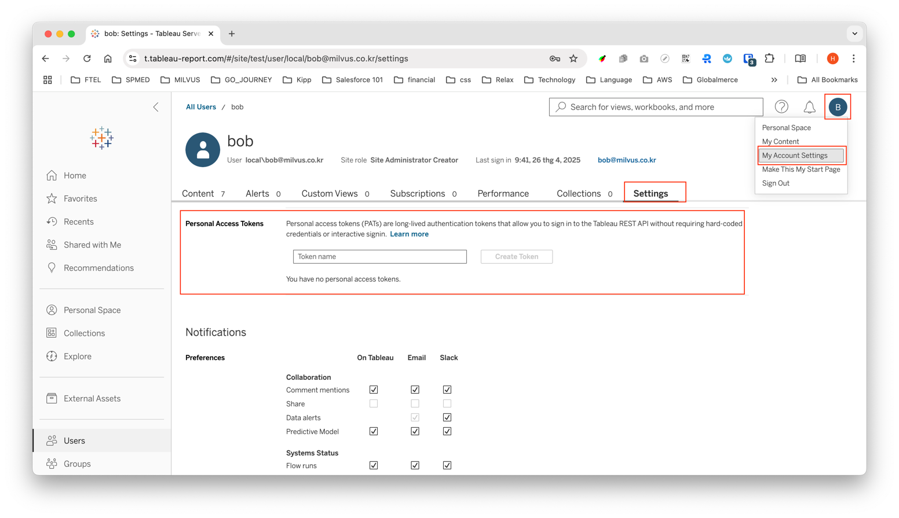

# TableauIntegrationApplication
- Hướng dẫn tích hợp với TableauCloud và TableauServer

## Yêu cầu
- [ ] Token Issues
    - [ ] Các API get users, get groups phải có đính kèm token
    - [ ] Token issues trong vòng 15 phút, quá 15 phút thì issues lại token
    - [ ] Khi token hết hạn thì phải tự động retry lại 3 lần. Quá 3 lần thì thôi.
- [ ] Get resource với paging

## Triển khai

### Step 1: Tạo PAT
